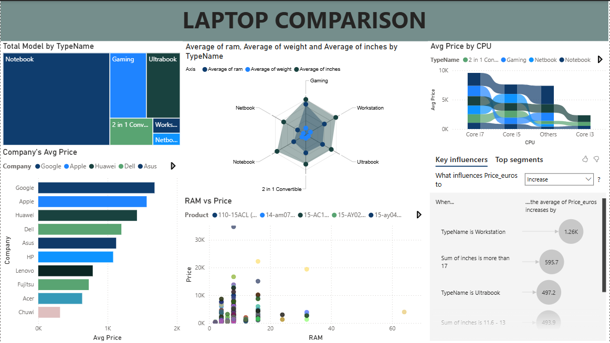

# Laptop_Price_Analysis
Data analysis project exploring laptop market trends using SQL and Power BI.

# 💻 Laptop Pricing & Market Intelligence Analysis

## 📌 Project Overview
This project explores the global laptop market to identify pricing trends, market segments, and inventory risks. By leveraging **SQL** for data processing and **Power BI** for interactive visualization, this analysis provides actionable insights into how technical specifications drive market value.

## 📊 Dashboard Preview

## 💡 Key Business Insights
* **Market Segmentation:** Successfully categorized 1,300+ SKUs into 4 tiers (Budget, Standard, Premium, and Ultra-High) using SQL logic, enabling better targeted marketing strategies.
* **The "Portability Premium":** Analysis reveals that ultra-lightweight devices (<1.3kg) maintain a 15-20% higher market value compared to heavier models with identical internal specifications.
* **Inventory Risk Identification:** Flagged specific clusters of 4GB RAM laptops priced non-competitively against 8GB models, highlighting potential "Dead Stock" risks.

## 📁 Technical Documentation
To explore the technical workflow and scripts used in this project, please visit the folders below:
* [**SQL Scripts (Cleaning & EDA)**](scripts/) - Detailed documentation of the data pipeline and transformation logic.
